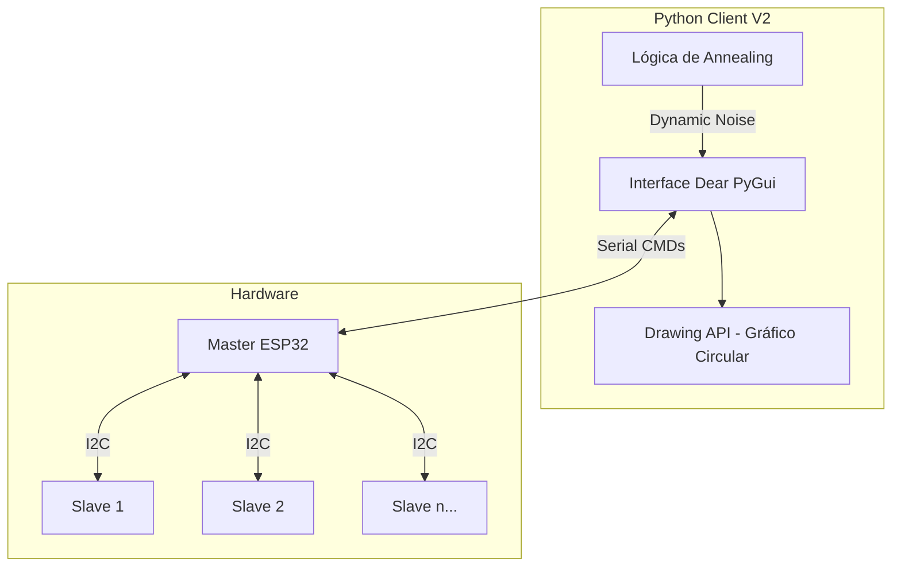

# Explicación del Cliente Quantum32 Max-Cut V2 (Dashboard Nativo)

El `pc_client_maxcutV2.py` es una aplicación de escritorio diseñada para controlar y visualizar el **Quantum32 Hybrid Sampler** en tiempo real. Utiliza la librería **Dear PyGui** para ofrecer una interfaz fluida con renderizado por GPU.

## 🏗️ Arquitectura del Sistema

El cliente funciona como el "Cerebro" que coordina al Master (ESP32) y procesa los datos de los Slaves.



## 🚀 Características Principales

### 1. Dashboard en Tiempo Real
- **Evolución del Score**: Gráfico lineal que muestra cómo el sistema encuentra mejores soluciones con el tiempo.
- **Distribución de Scores**: Histograma que ayuda a entender la calidad de las muestras.
- **Métricas**: Score actual, mejor score histórico, eficiencia y contador de muestras.

### 2. Gráfico de Partición Circular
Visualiza el problema de **Max-Cut** directamente:
- **Nodos**: Representan los bits del sistema (16 bits en anillo).
- **Colores**: Cambian dinámicamente. El rojo y el verde indican los dos grupos ("partitions") del corte.
- **Aristas (Edges)**: Se iluminan cuando la conexión entre dos nodos contribuye al puntaje del corte.

### 3. Simulated Annealing (Recocido Simulado)
Esta es la técnica clave para evitar que el sistema se quede atrapado en soluciones mediocres (mínimos locales).
- **T Ini (Alta)**: Al principio, el sistema tiene mucho ruido para explorar muchas combinaciones.
- **T Fin (Baja)**: Al final, el ruido baja para que la red se "congele" en la solución óptima.

## 🛠️ Cómo Utilizarlo

### Requisitos
Necesitas tener instalado Python y las siguientes librerías:
```bash
pip install pyserial numpy dearpygui
```

### Ejecución
En la consola de Anaconda/Spyder o terminal estándar:
```python
%runfile 'pc_client_maxcutV2.py' --wdir
```

### Flujo de Trabajo Recomendado
1. **Configurar Puerto**: Asegúrate de que el `Puerto Serial` coincida con tu Master (ej: `COM16`).
2. **Batch K**: Define cuántas muestras quieres (ej: `500`).
3. **Activar Annealing**: Marca la casilla `Simulated Annealing`.
4. **Parámetros T**: Pon `T Ini: 0.35` y `T Fin: 0.05`.
5. **Iniciar**: Haz clic en **CONECTAR / INICIAR**.
6. **Observar**: Mira el gráfico circular. Verás cómo los colores "bailan" al principio y se estabilizan al final en una configuración de máximo corte.

## 🔄 Botones de Control Especiales
- **REINICIAR MUESTRA**: Limpia todo y vuelve a lanzar el experimento. Ideal para probar cambios rápidos.
- **LIMPIAR ESTADÍSTICAS**: Resetea los gráficos pero mantiene la conexión actual.
- **GUARDAR CSV**: Exporta todos los datos recolectados a un archivo para análisis posterior en Excel o Python.

---
> [!TIP]
> Si el sistema no llega al 100% de eficiencia, intenta aumentar el valor de **K** (muestras) o el intervalo entre **T Ini** y **T Fin**.
